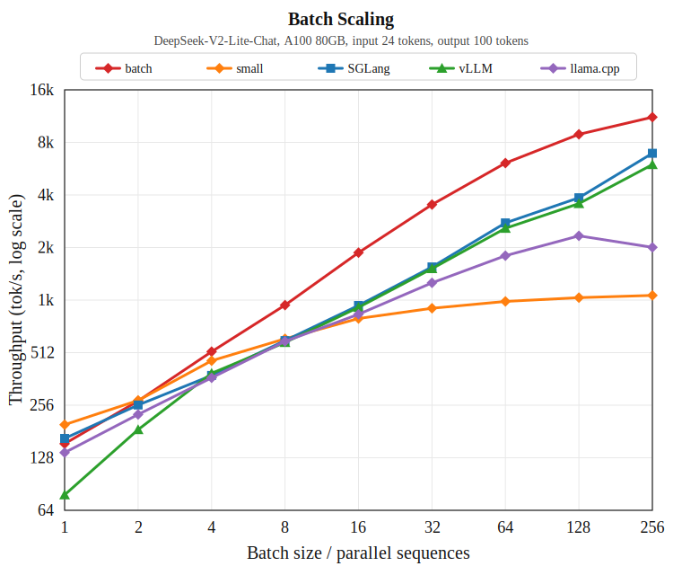

# Third-Party Baselines

This note records the reproducible third-party baseline setup for
`DeepSeek-V2-Lite-Chat` downloaded from ModelScope.

## Model Artifacts

- HF/ModelScope weights: `/data/home/tianjianyang/models/DeepSeek-V2-Lite-Chat`
- llama.cpp F16 GGUF: `/data/home/tianjianyang/models/gguf-models/DeepSeek-V2-Lite-Chat-F16.gguf`

The baseline wrappers default to these local paths and can be overridden with
`MODEL_PATH=...` or `DSV2_GGUF=...`.

## Environments

| Baseline | Environment | Entry |
| --- | --- | --- |
| SGLang | `/data/home/tianjianyang/.conda/envs/dsv2lite-sglang-fa311` | `baselines/sglang/bench_dsv2_lite.sh` |
| vLLM | `/data/home/tianjianyang/.conda/envs/dsv2lite-vllm` | `baselines/vllm/bench_dsv2_lite_latency.sh` |
| llama.cpp | `/data/home/tianjianyang/.conda/envs/dsv2lite-llamacpp` plus `/data/home/tianjianyang/code/llama.cpp/build-cuda-a100` | `baselines/llama_cpp/bench_dsv2_lite.sh` |

## Single-Batch Decode Results

All results below use RTX A6000, batch size 1, input length 24, output length
100, BF16/F16 weights as supported by each backend, and GPU 2 when rerun.

| Backend | Command shape | Decode TPS | Log |
| --- | --- | ---: | --- |
| SGLang 0.5.9 | `bench_one_batch --batch-size 1 --input-len 24 --output-len 100 --cuda-graph-bs 1` | 110.26 tok/s | `/tmp/dsv2lite_batch_rerun_20260425_004625/sglang/bs1.jsonl` |
| vLLM 0.16.0 | `vllm bench latency --batch-size 1 --input-len 24 --output-len 100 --cudagraph-capture-sizes 1` | 67.13 tok/s | `/tmp/dsv2lite_batch_rerun_20260425_004625/vllm/bs1.log` |
| llama.cpp | `llama-batched-bench -npp 24 -ntg 100 -npl 1 -ngl 99 -fa on` | 99.92 tok/s | `/tmp/dsv2lite_batch_rerun_20260425_004625/llama_batched_bench_1_256.jsonl` |

## SGLang Notes

SGLang is faster than vLLM and llama.cpp in this reproduction for the comparable
single-batch decode path. The earlier 109.06 tok/s value was from the same path;
the April 25, 2026 rerun reports 110.26 tok/s.

The SGLang log still warns that the RTX A6000 MoE tuning config is missing:

```text
E=64,N=1408,device_name=NVIDIA_RTX_A6000.json
E=64,N=1408,device_name=NVIDIA_RTX_A6000_down.json
```

So the current SGLang result is a functional official default, but not a fully
auto-tuned A6000 MoE result. On hardware with tuned configs, or after generating
those configs with SGLang's fused MoE benchmark tools, SGLang may improve.

## Batch-Size Sweep Results

The third-party batch-size sweep below was rerun serially on physical GPU 2 on
April 25, 2026. Shape is input length 24 and output length 100. Logs are under
`/tmp/dsv2lite_batch_rerun_20260425_004625`.



The plot includes the third-party baselines and the current `src/sota` custom Triton path.

| Batch | SGLang decode tok/s | vLLM output tok/s | llama.cpp batched tg tok/s |
| ---: | ---: | ---: | ---: |
| 1 | 110.26 | 67.13 | 99.92 |
| 2 | 154.86 | 124.02 | 155.50 |
| 4 | 213.02 | 208.98 | 233.66 |
| 8 | 311.40 | 301.30 | 359.21 |
| 16 | 482.08 | 461.50 | 518.28 |
| 32 | 819.97 | 760.38 | 772.79 |
| 64 | 1359.07 | 1291.24 | 1081.21 |
| 128 | 1884.23 | 1740.49 | 1363.71 |
| 256 | 3387.60 | 2944.65 | 1563.54 |

Notes:

- SGLang values are `median_decode_throughput` from `bench_one_batch` JSONL with `--cuda-graph-bs` matching batch size.
- vLLM values are `batch_size * output_len / Avg latency` from `vllm bench latency`; this includes prefill plus decode for the request batch, so it is not exactly equivalent to SGLang decode-only median. The attempted `batch_size=512` run is excluded because vLLM scheduled it as two 256-request waves (`Running: 256 reqs, Waiting: 256 reqs`), so it was not a valid bsz=512 measurement.
- llama.cpp values are from `llama-batched-bench -npl`, i.e. real parallel sequences. The tool refused `npl=512` with `n_seq_max must be <= 256`, so the valid llama.cpp curve stops at 256.


## src/sota Batch Sweep

The current custom Triton path was rerun on physical GPU 2 on April 25, 2026
after changing batched MoE from per-route GEMV to expert-grouped GEMM-style
Triton kernels. Shape is input length 24 and output length 100. Logs are under
`/tmp/dsv2lite_grouped_sweep_20260425_101935`.

| Batch | Path | Decode tok/s |
| ---: | --- | ---: |
| 1 | `triton_sota_graph` | 136.36 |
| 2 | `batched_cuda_graph` | 183.00 |
| 4 | `batched_cuda_graph` | 360.15 |
| 8 | `batched_cuda_graph` | 600.38 |
| 16 | `batched_cuda_graph` | 945.53 |
| 32 | `batched_cuda_graph` | 1262.38 |
| 64 | `batched_cuda_graph` | 2066.46 |
| 128 | `batched_cuda_graph` | 2876.35 |
| 256 | `batched_cuda_graph` | 3451.47 |
| 512 | — | OOM during `graph_cache.snapshot()` |

Note: after grouped MoE, 256 now runs successfully. The 512 run still fails
while cloning the prompt KV cache snapshot, with the process using essentially
the full 47.40 GiB A6000 memory.

## Reproduction Commands

```bash
RUN_DIR=/tmp/dsv2lite_batch_rerun_20260425_004625
mkdir -p "${RUN_DIR}"

RESULT_DIR="${RUN_DIR}/sglang" GPU=2 BATCH_SIZES="1 2 4 8 16 32 64 128 256" \
  baselines/sglang/bench_dsv2_lite_batch_sweep.sh 2>&1 | tee "${RUN_DIR}/sglang.log"

RESULT_DIR="${RUN_DIR}/vllm" GPU=2 BATCH_SIZES="1 2 4 8 16 32 64 128 256" \
  baselines/vllm/bench_dsv2_lite_batch_sweep.sh 2>&1 | tee "${RUN_DIR}/vllm.log"

RESULT_DIR="${RUN_DIR}/llama_cpp" GPU=2 BATCH_SIZES="1 2 4 8 16 32 64 128 256" \
  baselines/llama_cpp/bench_dsv2_lite_batch_sweep.sh 2>&1 | tee "${RUN_DIR}/llama_cpp.log"
```
